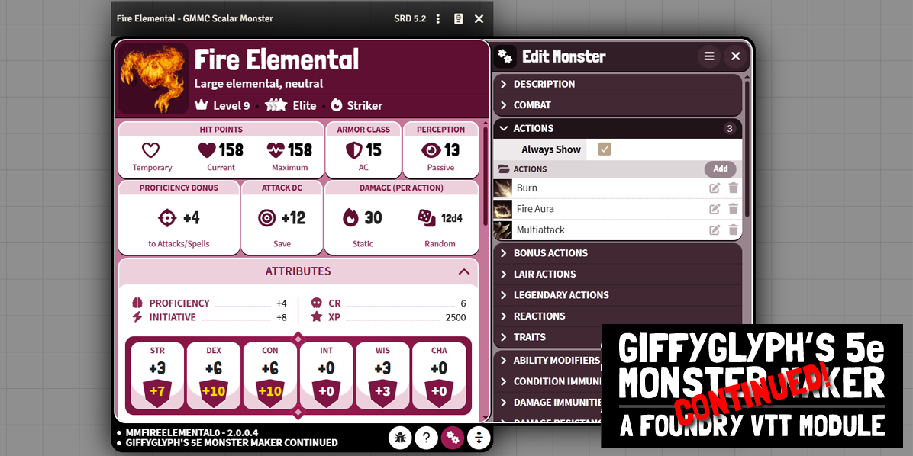

# Changelog

## v2.0.1.1

* Removed optional dependencies - foundry was breaking and making them all required.
* Short rest and long rest buttons on the Forge sheet. They run the same rest a vanilla NPC sheet does, so everything that recovers on a rest now actually recovers: paragon defenses refill on a long rest, and an action set to recharge on a short rest, long rest or day gets its uses back.
* "Day" uses come back on a long rest that is a new day.
* The long rest card now names the paragon defense pool it refilled instead of printing the internal flag path.
* GMM conditions are now a real compendium of effects. Foundry v14 lets a module ship active effects directly, so the eighteen expanded conditions live in a new **GMM Effects** compendium, instead of being hidden on a placeholder actor you had to open first. You can browse, search, and drag them straight onto a token.
	* Each condition now states its rarity the way the book does. This will be used later to try to estimate Scaler point values!
	* This needs Foundry v14. On v13 the new compendium cannot exist at all, so the old **GMM Conditions (Legacy)** compendium is still there with the same conditions on its placeholder actor. It is frozen and won't get any updates, namely automation.
	* If you use the *Side Effects* module, you can point its effect compendium setting at GMM Effects, or copy the conditions into your own effect compendium.
	* Also in v14, there are basic automations for the conditions, utilizing both base effects, *MidiQOL*, and *Automated Conditions 5e*.
* Dropped the *DFreds Convenient Effects* importable file and the leftover Convenient Effects data on the conditions.
* More attributes are handled correctly now though effects and visually displayed as changed on the sheet when effects are active. This includes (temp)max HP, initiative, skill modifiers, attribute modifiers, global mods (i.e. +2 to all checks), and proficiency.
* [hpMax] now targets `effective_maximum`, so is modified by temporary max HP, and effects like 2014's exhaustion. A new [naturalMax] shortcode has been added to reference the monster's max hp ignoring temp max.
* The Proficiency block on the artifact is now "To-Hit Bonus". By default that matches proficiency, but modifiers will now make sense.
	* A global attack bonus from an effect now shows in that block, and in the basic attack roll dialog.
* Deferral automation! Deferred abilities will now properly wait before rolling attacks or applying effects where appropriate. This is compatible with *MidiQOL*, but some amount of the automation works without it.
* Updated compendiums to include proper appropriate effects, etc, to let them function with as much automation as has been built. The entries will indicate in their description how they're automated.
* Shortcodes are now available in the effects editor (including with *Dyamic Active Effects*). They can be accessed with `@gmm.*`, where * is the shortcode. This does not support roll formula shortcodes (things like `[damage, damageDie]`) since you can just either alter the outgoing damage with an effect, or alter `@gmm.damageDie` for the scaling ability. 

## v2.0.1.0

* The sheet-converted level now reads the challenge rating directly instead of the experience value dnd5e works out from it. This lets stuff like the +1 CR "in lair" change matter. It also means that GMM's level/rank calculation can matter, so a CR14 isn't always a level 14 scaler if it's also an elite or paragon.
	* This does leave a weird edge case I'm thinking about - a CR14 monster that doesn't have legendary or lair actions becomes a level 22 grunt. Is that OK? I'm not sure yet.
* A converted monster with no challenge rating at all now starts at level 1 rather than level -5.
* Paragon defenses are now offered on a failed saving throw. With MidiQOL installed you get a prompt before damage is applied. Without Midi the failed-save card gets a button similar to the Legendary Resistance button. Either way it spends the hit point cost and one defense, never spends hit points it cannot survive, and never eats temporary hit points. The pool refills on a long rest.
* The Legendary Resistance button now follows the stat block: if paragon defenses have replaced the legendary resistances section on the sheet, the button stops appearing too. Tick "always show" on legendary resistances to see both if you really want to.
* Paragon actions are now tracked in combat: taking a full action outside its own turn spends one, and the pool refills at the start of its turn and at the start of a fight. You'll get a warning if you take an action with no paragon actions available.
* Module settings for Paragon Defense and Action automation.
* Began to add better support for automation modules using GMMC scalar effects
* Active effects that change an ability score or modifier now reach the whole monster instead of only the die roll: the displayed modifier, spell save DC, initiative, passive perception, carrying capacity, shortcodes and generated activities all follow. Effects can target either the score or the modifier, and an effect that sets a score to a fixed value correctly does nothing to a monster whose scaled score is already higher. Hovering the modifier names the effect responsible.
* Fixed skill totals and passive scores being assembled as text rather than added up, which made them wrong everywhere except the Forge sheet.
* Ability check, skill and initiative bonuses now reach the stat block instead of only the die roll. Skill totals and passive scores include them, an ability's check bonus shows up in the sheet's ability check roll, and passive perception counts them the way dnd5e does
* Fixed a scaling monster's initiative total and passive initiative score being derived from its unscaled ability modifier. This was visible if you use the "Fixed Initiative Score" setting, where a monster rolled a score that ignored its scaling
* The paragon defenses maximum now has its "is fixed" toggle, so the modifier can override the rank-derived value instead of only adding to it
* The saving throw modifiers field now works, and applies to every saving throw method
* Added a "Custom Unique" saving throw method, which starts every save at 0 so the modifiers field sets them outright
* Renamed the "Custom TST" saving throw method to "Custom Trained Saves"
* Saving throw rolls now honor whatever the forge derived, rather than only the ability modifier and proficiency
* Saving throws now include the actor's global save bonus, which was previously dropped from the stat block
* Fixed the saving throw, ability attack and spellcasting attack/modifier values a scaling monster reports to other modules and to the vanilla NPC sheet, which were left over from before scaling was applied. This probably doesn't have a visible consequence, but matters if other content reads info about a GMMC scalar.
* Active effects that target `flags.gmm.blueprint` now warn in the console instead of silently half-working. The blueprint is a monster's saved definition, read before effects are applied, so an effect aimed at it could change the hover breakdown of a stat without changing the stat itself. To buff a scaling monster, target the regular D&D field instead - for example an ability score rather than the monster's level.
	* It's possible that I add keys later that are intended to work with active effects.

## v2.0.0.10

* Fixed some remaining compendium oopsies.
* Removed the GGMMv2 items from the compendiums.
* Fixed some pathways where renaming the monster wouldn't rename the prototype token.
* Sync paragon defenses, and converted monsters get defenses correctly.
* Enabled drag and drop in the V2 sheet rework
* Fixed some old button rendering
* Fixed bug with custom TST sometimes desynching

## v2.0.0.9

* Fixed an issue that sizing forge windows could mess up NPC sheets and vice versa
* Moved a few hardcoded strings into lang file.
* Fixed shortcoder eating legit errors in some cases.
* Fixed disadvantage rolls getting eaten
* Updated range lables to handle more cases, such as enemies with X feet.

## v2.0.0.8

* Fixed several action fields (such as "Recharges On" and the range Units dropdown) not saving on Foundry v13.
* Fixed clearing an action's description not always persisting.
* Fixed compendium attacks not showing their normal hit damage formula.
* Fixed a duplicate blank option in the resource-consumption target dropdown, and "This Item" not staying selected.
* Removed unused attack templates that had no scaling data, plus some dead internal code.
* Dev-only files (docs, stylesheets, git hooks) are no longer bundled in the packaged download.

## v2.0.0.7

* Made the select helper for v14 also fire in v13 to avoid deprecation warnings
* Fixed compatibility for other modules (quick insert specifically) that tied in to npc sheets based on DOM elements
* Fixed an issue where having multiple monsters open would cause rolls to use the wrong monster
* Fixed empty-target actions not saying 'one target' by default.

## v2.0.0.6

* Git related changes, such as fixing packaging cleanup on levelDBs. This probably doesn't affect you unless you're rebuilding packs yourself.
* Fixed monster proficient save bonuses being incorrect at some levels
* Fixed duplicated compendium entries in attacks
* Fixed the recharge button on the monster sheet not working
* Fixed ranged/melee label on converted attacks
* Fixed the uses counter not persisting in dnd5e 5.3
* Fixed weight not showing correctly on loot
* Minor Handlebars updates
* Typo fixes and language standardization.

## v2.0.0.5

* Moved the compendiums to the v13 format, which can easily forward to v14. There's a breaking change in here that means we'll be on the v13 format until support is dropped (when it will get its own forever-branch)
* Fixed a bunch of typos in the compendiums
* Gave uncommon and rare abilities their uses per day

## v2.0.0.4

This is the refined build, post-human-investigation, that is a viable candidate for re-merge into main. It can be used in live games if you're a bit adventurous. 

* Updated to maintain compatibility with v13.
* Made action transition to gmmc non-destructive to allow you to toggle if you wanted.
* Github actions to save my brain from manual work editing manifests
* More shortcodes!

## v2.0.0.0

#### Foundry v14 & DND5e 5.3.2

"Yee Haw"

THIS UPDATE IS LARGELY WRITTEN VIA AI. THIS SHOULD NOT BE USED IN ANY LIVE GAME, NOR BE EXPECTED TO SAFELY HANDLE ANY IMPORTANT DATA.

Treat this as an extreme alpha, it's really just an experiment to see if an LLM can do the heavy lifting to move the codebase to V14/DND5.3 so I can continue to work on it in a reasonable manner.

Again, I DO NOT TRUST THE AI, AND NEITHER SHOULD YOU. Over time I will be reviewing each change it made here to ensure that it is actually usable, and fix it where it breaks if possible.

* Many bugs that were present in previous versions are fixed.

## v1.1.2.3 (v12)

* #69 Fixed a deprecation (an old one!) that was sneaking by and finally broke in dnd5e 3.3.1. It was preventing damage from being added or removed from scaling abilities.
* Fixed bug in damage rolling in certain circumstances (from dev c29c7b2)

## v1.1.2.2

* Confirmed dnd5e 3.3.0 compatibility
* #59 Fixed descriptions on items to use the new editor and updated save/load code for same
* #62 Fixed some bugs around damage rolling by updating to the newer rollConfigs format
* Fixed bug with shortcodes 
* #60 Fix with max attribute breaking TST count
* Fixed bug in damage rolling in certain circumstances

## v1.1.1.3

* #57 Bugfix for enter adding effects to abilities and monsters when editing fields

## v1.1.1.2

* Foundry v12 support (tentative)
* dnd5e 3.2 support (tentative)
	* Dice formula error checking fix
	* Weight conversions
* #56 Maximum dice now works for shortcoded damage

## v1.1.0.7

* Added MidiQOL and DFred's Convenient Effects as 'recommended' modules. They're not required for GMMC to function, but GMMC has content for them if you are using them.
* Put the compendium folders in a "Giffyglyph's Monster Maker" top level folder for easier sorting. It's green!
* #19 V12 compatibility updates for the RC and dnd5e 3.1. **V12 IS A BETA!** You shouldn't use it for in-progress games even when it reaches "stable" soon. Please do report issues you find, just be aware that some functionality may take time to fix! Additionally, whenever dnd5e 3.2 comes out that will likely break things too.

* #34 Added support for ability rarity. This is selected under the "Action Type" accordian on the action editor. 
	* Abilities will display color and border tags for their rarity, as well as listing it on the editor.
	* Updated rarities for all items in the compendiums that have rarities.
	* This change is mainly visual and for tracking abilities as a GM, it doesn't restrict anything about ability creation.

* #43 Added a new compendium for Conditions. (pdf 75)
	* Simply drag and drop conditions from the actor in the compendium as necessary
	* Where possible, these have active effects as well (Some may require MidiQOL or DAE).
* #43 (continued) Included an importable json for DFred's convenient effects that adds all of the conditions as custom CE's.
	* That file can be found in the 'importables' directory of the module's folder.

* #48 Added *deferrals* to features. (pdf 43)
	* They have a new dropdown in the feature editor window where you can set the type of deferral (dooming or delayed), their timer, and a respite/dispel condition.
	* There is no automation associated with these at the moment. Roadmap item?

* #50 Added an effects tab for Monsters and Features
	* You can now view and create effects similar to the 'effects' tab in the default sheets.
	* It's in the 'effects' dropdown in the blueprints
	* Drop Active Effects onto sheets to add them to the monsters, or make your attacks apply conditions when they hit!

* #38 Reorganized the monster blueprint sidebar to improve logical organization and readability. I'm open to [suggestions](https://github.com/Skyl3lazer/giffyglyph-monster-maker-continued/issues/38) if you have opinions on what is where.
	* The vague idea now for the categories: Basic, Scaling Abilities, General Features, Overrides, Flavor, "Loot", Display
* Fixed an issue if you converted a monster with no creature type.
* #47 Compendium fixes (typos, settings, etc)
* #42 Fixed the "add" button for inventory items not working
* #42 (cont) If "always show" is enabled for either encumbrance or currency, the inventory will show.
* #41 Added overkill attacks, and a mix of delayed/mixed effect attacks to the attacks compendium.

## v1.0.2.1

* Fixed non-save traits throwing console error
* Fixed Activation Condition sometimes preventing a monster load
* Fixed Powerful Build (inventory) not doing anything
* #36 Fixed interactions between actions and encumbrance variants
* #44 Fixed checking for wrong updated thing (foundry rather than dnd5e) for a backwards compatibility issue

## v1.0.1.2

1.0 is here! In addition to a number of bugfixes and compatibility updates, 1.0 features a few big ticket items:

* GMMv3 Compendium Updates! You can now add Traits, Features, and Attacks directly from the v3 PDF!
	* This means that the compendiums are now in the new format, rather than the old ".db" files that get converted and take time to load.
	* These new compendiums have built in scalars, attacks, etc, that all work right out of the box and look great.
	* The old items are still available in the !V2 folders within compendiums if you want to use them.
	* Hardlinks to compendium items will break! This is a one time unavoidable change, and had to happen either now or later (when you had links to new items).
	* In the future I'd like to add DAE and others as optional dependencies and add DAE/automation to the compendiums!

* In service of the new compendiums, there are a number of new QOL features when building your own scalar abilities, such as
	* Finally being able to see the range/etc on attacks that don't roll to-hit or have a save (utility, healing, other, etc)
	* New shortcodes! [name] and [maxMod] can be used anywhere.
	* You can select "Highest Ability" for the Related Ability dropdown in the Attack menu to make your scalar ability automatically use whatever highest stat your monsters have.
	* Monster abilities can now require concentration.

* NOTE ON FOUNDRY V10 SUPPORT:
 	* **V10 SUPPORT WILL END NO LATER THAN V14. IT MAY END IN V13, DEPENDING ON CHANGES.**
	* I have tried to maintain support for v10 in the 1.0 launch, and have been *mostly* successful. There are a few caveats
	* Concentration will only work on spells.
	* The new Traits compendium will not be available, and the Features/Attacks compendium won't be getting the updates.
		* This is because the format of the compendiums has changed and is not backwards compatible, and creating new compendiums ONLY for V10 (and being unable to use folders) isn't feasable for me.
		* If you want to create new v10 compendiums and pull request them I'm happy to look
	* For now it looks like I can keep V10 support in V12.
	* As support is still active for V10, please submit any bugs you find, even if they are V10 specific!
	* Whenever V10 support does end, I'll create a V10 branch you can continue to use (similar to the current MMv2 branch).
	* I highly recommend you upgrade to V11.

Full changelog:

* v12 Foundry Deprecation Fixes (v12 not supported currently on this branch)
* #20 dnd5e 3.1 compatability
* #18 Fixes to swarm size
* #21 Fixes for hit points, including max hp issues on 3.0
* #22 Added the [name] shortcode
* #23 Fixed display of formula rolled hp
* #24 Fixed using ammo items on scaling abilities, and cleaned up chat messages when you do so [mainly a legacy feature]
* Fixed spell save DC calculations (for actual spells you give monsters)
* Fixed components and VSM info for spells
* Fixed loot item value showing on sheet, and added units
* #28 Added a "Highest Stat" option to the "Related Ability" dropdown in Attack Option, which lets a scalar ability always scale off of the Highest Stat
* #27 Added a related shortcode [maxMod]
* #32 Added hinter text to anything with an attack if it has a to-hit, range, area, or save DC. 
	* I.E. You can now add a range+area to a utility attack and have it show.
* #29 Added a GMMv3 "Traits" compendium
	* This is a first take on this compendium. If you find an issue, please report it.
* #30 Updated the "Powers" compendium to GMMv3
	* This is a large update to this compendium. If you find an issue, please report it.
* #31 Updated the "Attacks" compendium to GMMv3
	* Should now have the balance numbers from the V3 PDF, and naming scheme changed to match (even if many are functionally the same as V2)
	* This is a large update to this compendium. If you find an issue, please report it.
	* More examples will be added in the future.
* #33 Added ability for Scalar Abilities to require Concentration
	* This also sets me up to be able to support other "Properties" (magical, etc) on Scalars in the future.
* Added description pills to show duration, concentration, and activation requirement (for now)
* Added a few v10 compatibility tweaks
* Renamed the folder/dbs for the compendiums to be consistent with their name. 
	* This will break existing hardlinks to compendium items, but is necessary at some point in the future anyway.

## v0.12.0.2 (latest)

* Shortcoder warning supression for roll commands
* Fixes for paragon defense modifications and display

## v0.11.0.3

* Fixed an issue with async data loading on monster sheets, bringing back foldout descriptions on items! [#16](https://github.com/Skyl3lazer/giffyglyph-monster-maker-continued/issues/16)

## v0.11.0.2

* Made the shortcoder work on item descriptions and chat output.
* Made the 'chat' button on item cards display a description card instead of rolling the item. Thanks to @thatlonelybugbear from the Midi discord!
* Monster items added to a master sheet will properly become the correct type.

## v0.10.0.3

* Fix to module manifest for dnd5e version compatability

## v0.10

* Testing/confirming v11 compatability

## v0.9.3

* Fixed a small libwrapper issue that affected non-gmm item usage for some automations.

## v0.9

* Fixed ability_bonus on rank not affecting creatures
* Fixed some issue with libwrapper hooks doing unintended things to non GMM monsters (specifically item rolls)
* Updated pack deprecations. Note they still aren't all v3 abilities.
* Added missing strings
* Fixed paragon defenses reporting as action amount

## v0.8

* Added a shortcoder to CONFIG.Item.documentClass.prototype.use to make the damage on the item get shortcoded in at use-time
  * This should make shortcodes integrate better to other mods like RSR
* Fix for non-gmm shortcodes in descriptions breaking
* Updated some missing strings

## v0.7

* Fixed an issue with save DCs being null
* Added libwrapper as a dependency, and implemented it to cover anything that we wrapped already
* Updated processing for the following items to be affected by DAE and display correctly
  *  AC, Skills (proficiency and check bonuses), Passive Perception, Saving Throws, Initiative (doesn't display right)

## v0.6

* Fixed damage types
* Fixed occasional error with blank form fields causing errors

## v0.5

* Fixed damage, misses, and versatile damage

## v0.4

* Updating to GMM v3

## v0.3

* Updated to Foundry v10, dnd5e 2.1+, GMM v2
